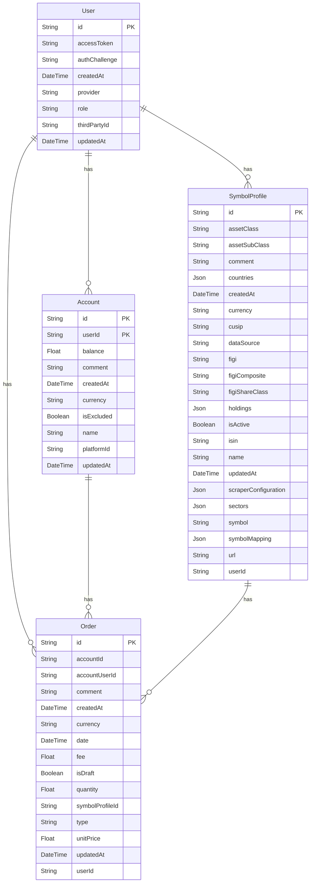

# Database Schema

This document provides an overview of the Ghostfolio database schema. The schema is defined in the `prisma/schema.prisma` file.

## Entity-Relationship Diagram (ERD)

The following diagram illustrates the relationships between the main tables in the database:

## Tables

The database consists of several tables. Here are some of the most important ones:

*   **User**: Stores user information, including authentication details and preferences.
*   **Account**: Represents a user's investment account.
*   **Order**: Represents a single transaction (buy, sell, dividend, etc.).
*   **SymbolProfile**: Stores information about a specific financial instrument (stock, ETF, etc.).
*   **MarketData**: Stores historical market data for each symbol.
*   **Tag**: Represents a user-defined tag that can be assigned to orders.
*   **Platform**: Represents a brokerage or other financial platform.
