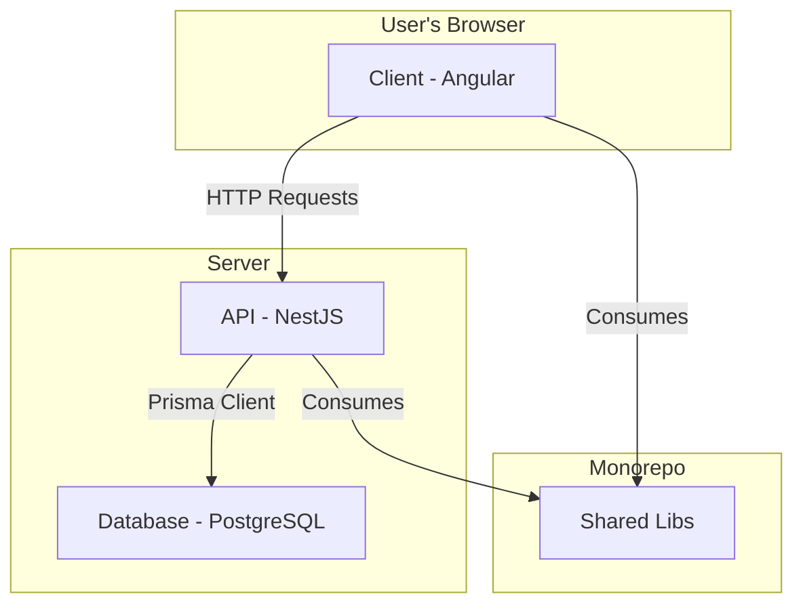

# Project Architecture

This document provides a high-level overview of the Ghostfolio project's architecture.

## Monorepo Structure

Ghostfolio uses an [Nx](https://nx.dev) monorepo to manage its codebase. The project is divided into three main parts:

*   `apps/api`: The NestJS backend application.
*   `apps/client`: The Angular frontend application.
*   `libs`: Shared libraries used by both the `api` and `client`.

## Client-Server Architecture

Ghostfolio follows a classic client-server architecture. The `client` is a single-page application (SPA) that runs in the user's browser, and the `api` is a Node.js server that provides data to the client.

### Data Flow

1.  The **client** makes HTTP requests to the **API**.
2.  The **API** processes the requests, interacts with the **database**, and returns data to the client.
3.  The **database** is a PostgreSQL instance managed by Prisma.

## Architecture Diagram

The following diagram illustrates the high-level architecture of the Ghostfolio application:

